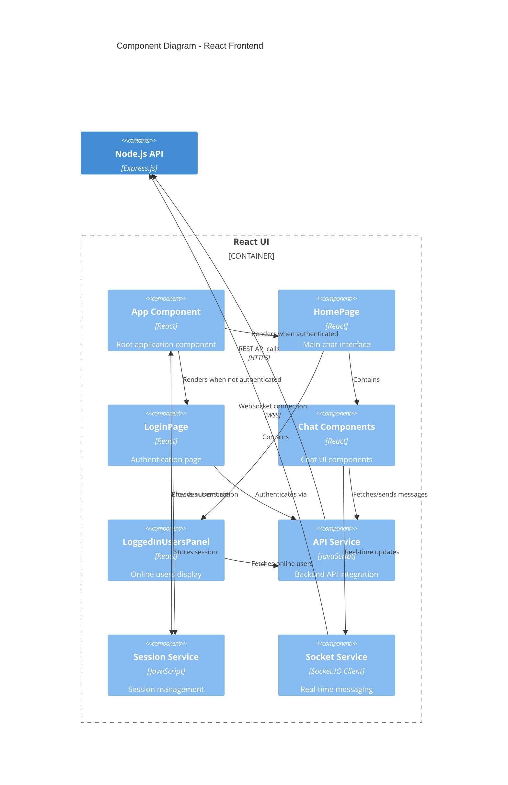

# C3 - Component Diagram (Frontend)

## Overview

Shows the internal components of the React UI application and their relationships.

## Diagram



## Key Components

### App Component (`App.js`)

**Responsibility**: Root application component

**Key Features**:
- Application entry point
- Route management (login vs. home)
- Session persistence check
- Global state management
- Loading state handling

**State**:
- `user`: Current authenticated user
- `loading`: Application initialization state

**Flow**:
- Checks for existing session on mount
- Renders LoginPage if not authenticated
- Renders HomePage if authenticated

### LoginPage Component (`LoginPage.js`)

**Responsibility**: User authentication interface

**Key Features**:
- Username input (no password required)
- Form validation
- Login/register functionality
- Error handling and display
- Loading states

**Dependencies**:
- `apiService` - API calls for authentication
- `sessionService` - Session storage

**Flow**:
1. User enters username
2. Calls `/api/auth/login` or `/api/auth/register`
3. Stores session on success
4. Triggers login callback to App

### HomePage Component (`HomePage.js`)

**Responsibility**: Main chat application interface

**Key Features**:
- Logged-in user experience
- Container for chat and user panel
- Logout functionality
- WebSocket connection initialization

**Child Components**:
- Chat components (conversation list, message window)
- LoggedInUsersPanel

**Props**:
- `user`: Current user object
- `onLogout`: Logout callback

### Chat Components (`components/Chat/`)

**Responsibility**: Chat interface functionality

**Sub-Components**:
- **ChatList**: Displays list of conversations
- **ChatWindow**: Shows messages in a conversation
- **MessageInput**: Compose and send messages
- **ToneSelector**: Select message tone (funny, playful, serious)
- **Message**: Individual message display

**Key Features**:
- WhatsApp-style chat interface
- Real-time message updates
- Tone selection for outgoing messages
- Message history scrolling
- Typing indicators (future)

**Dependencies**:
- `apiService` - Fetch/send messages
- `socketService` - Real-time updates

### LoggedInUsersPanel Component

**Responsibility**: Display online users

**Key Features**:
- Lists currently online users
- Excludes current user
- Polling or WebSocket updates
- User profile display
- Click to start conversation

**Data Source**:
- `/api/users/online` endpoint
- Polls every 5 seconds with caching

### API Service (`services/api.js`)

**Responsibility**: Backend API integration

**Key Functions**:
- `login(username)` - User authentication
- `register(username)` - New user registration
- `logout()` - End session
- `getOnlineUsers()` - Fetch online users
- `sendMessage(message)` - Send chat message
- `getMessages(conversationId)` - Fetch message history
- `getConversations()` - Fetch conversation list

**Features**:
- HTTP client wrapper (fetch API)
- Request/response handling
- Error handling and parsing
- Authentication token management
- Base URL configuration

**Pattern**: Centralized API calls

### Session Service (`services/session.js`)

**Responsibility**: Session and authentication state

**Key Functions**:
- `getSession()` - Retrieve current session
- `setSession(user)` - Store session data
- `clearSession()` - Remove session (logout)
- `isAuthenticated()` - Check auth status

**Storage**: localStorage for session persistence

**Pattern**: Singleton service for session management

### Socket Service (`services/socketService.js`)

**Responsibility**: Real-time WebSocket communication

**Key Functions**:
- `connect(userId)` - Establish WebSocket connection
- `disconnect()` - Close connection
- `sendMessage(message)` - Send real-time message
- `onMessage(callback)` - Listen for incoming messages
- `onUserOnline(callback)` - User comes online event
- `onUserOffline(callback)` - User goes offline event

**Features**:
- Socket.IO client integration
- Connection state management
- Event-based messaging
- Automatic reconnection
- Room-based messaging

**Pattern**: Event-driven real-time communication

## Data Flow

### Login Flow

1. **LoginPage** captures username
2. **API Service** calls `/api/auth/login`
3. **Session Service** stores user data
4. **App Component** re-renders with authenticated state
5. **HomePage** is displayed
6. **Socket Service** connects for real-time updates

### Message Send Flow

1. **MessageInput** captures user message and tone
2. **Chat Component** calls API Service
3. **API Service** sends message to backend
4. **Socket Service** receives broadcast confirmation
5. **ChatWindow** updates with new message
6. **Message** component renders with tone-modified content

### Real-Time Message Receive Flow

1. **Socket Service** receives message event
2. **Event callback** triggers in Chat Component
3. **State updates** with new message
4. **ChatWindow** re-renders
5. **Message** appears in conversation

## Component Hierarchy

```
App
├── LoginPage (when not authenticated)
│   └── uses: apiService, sessionService
└── HomePage (when authenticated)
    ├── Chat/
    │   ├── ChatList
    │   ├── ChatWindow
    │   ├── MessageInput
    │   ├── ToneSelector
    │   └── Message
    ├── LoggedInUsersPanel
    └── uses: apiService, socketService
```

## State Management

**Approach**: React built-in state (useState, useContext)

**Global State**:
- User authentication (App level)
- Current conversation (HomePage level)
- Messages (Chat component level)

**Local State**:
- Form inputs (controlled components)
- UI states (loading, errors, modals)

## Related Diagrams

- [C1 - System Context](./c1-system-context.md) - High-level system view
- [C2 - Container Diagram](./c2-container.md) - Container architecture
- [C4 - Code Diagram](./c4-code.md) - Code-level patterns
- [Main Architecture](./architecture.md) - Complete architecture overview
