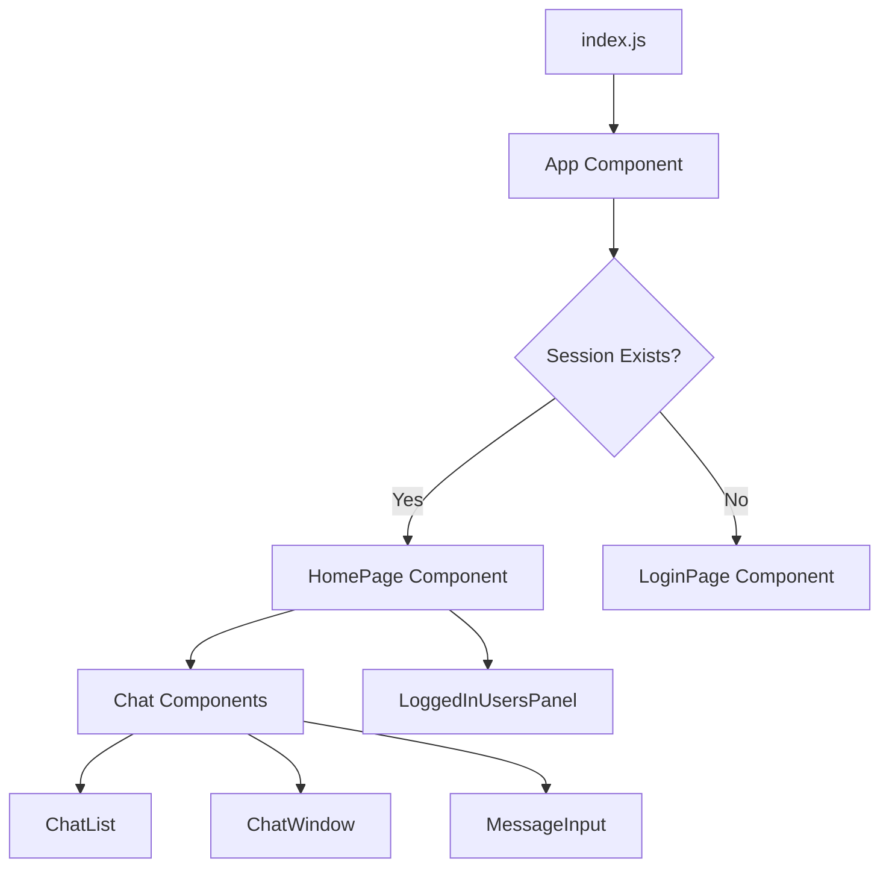
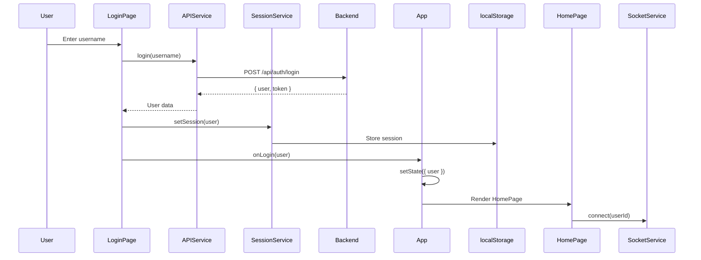

# C4 - Code Diagram (Frontend)

## Overview

Detailed code-level patterns and key implementation details for the React frontend application.

## Key Code Patterns

### Component Rendering Flow



**Implementation**: `src/App.js`, `src/index.js`

**Pattern**: Conditional rendering based on authentication state

### Authentication Flow



**Implementation**: `LoginPage.js`, `services/api.js`, `services/session.js`

**Pattern**: Service-based authentication with local storage persistence

### React Component Pattern

```javascript
// Functional Component with Hooks
import React, { useState, useEffect } from 'react';
import { apiService } from '../services/api';

function ChatWindow({ conversationId }) {
  // State management
  const [messages, setMessages] = useState([]);
  const [loading, setLoading] = useState(true);
  const [error, setError] = useState(null);

  // Side effects
  useEffect(() => {
    loadMessages();
  }, [conversationId]);

  // Event handlers
  const loadMessages = async () => {
    try {
      setLoading(true);
      const data = await apiService.getMessages(conversationId);
      setMessages(data);
    } catch (err) {
      setError(err.message);
    } finally {
      setLoading(false);
    }
  };

  // Conditional rendering
  if (loading) return <LoadingSpinner />;
  if (error) return <ErrorDisplay error={error} />;

  // Main render
  return (
    <div className="chat-window">
      {messages.map(msg => (
        <Message key={msg.id} message={msg} />
      ))}
    </div>
  );
}

export default ChatWindow;
```

**Pattern**: Functional components with hooks for state and effects

### API Service Pattern

```javascript
// services/api.js
const API_BASE_URL = process.env.REACT_APP_API_URL || 'http://localhost:3000';

class APIService {
  async request(endpoint, options = {}) {
    const url = `${API_BASE_URL}${endpoint}`;
    
    const defaultOptions = {
      headers: {
        'Content-Type': 'application/json',
      },
      credentials: 'include', // Include cookies
    };

    const response = await fetch(url, { ...defaultOptions, ...options });

    if (!response.ok) {
      const error = await response.json();
      throw new Error(error.message || 'API request failed');
    }

    return response.json();
  }

  login(username) {
    return this.request('/api/auth/login', {
      method: 'POST',
      body: JSON.stringify({ username }),
    });
  }

  getOnlineUsers(excludeUserId) {
    const query = excludeUserId ? `?excludeUserId=${excludeUserId}` : '';
    return this.request(`/api/users/online${query}`);
  }
}

export const apiService = new APIService();
```

**Pattern**: Singleton service with centralized HTTP client

**Features**:
- Base URL configuration
- Default headers and credentials
- Centralized error handling
- Promise-based async operations

### Session Management Pattern

```javascript
// services/session.js
const SESSION_KEY = 'midwest_chat_session';

export const getSession = () => {
  try {
    const session = localStorage.getItem(SESSION_KEY);
    return session ? JSON.parse(session) : null;
  } catch (error) {
    console.error('Failed to get session:', error);
    return null;
  }
};

export const setSession = (user) => {
  try {
    localStorage.setItem(SESSION_KEY, JSON.stringify(user));
  } catch (error) {
    console.error('Failed to set session:', error);
  }
};

export const clearSession = () => {
  localStorage.removeItem(SESSION_KEY);
};

export const isAuthenticated = () => {
  return getSession() !== null;
};
```

**Pattern**: Module exports with localStorage abstraction

### WebSocket Service Pattern

```javascript
// services/socketService.js
import io from 'socket.io-client';

class SocketService {
  constructor() {
    this.socket = null;
  }

  connect(userId) {
    if (this.socket?.connected) {
      return;
    }

    this.socket = io(process.env.REACT_APP_WS_URL || 'http://localhost:3000', {
      query: { userId },
      transports: ['websocket'],
    });

    this.socket.on('connect', () => {
      console.log('WebSocket connected');
    });

    this.socket.on('disconnect', () => {
      console.log('WebSocket disconnected');
    });
  }

  disconnect() {
    if (this.socket) {
      this.socket.disconnect();
      this.socket = null;
    }
  }

  onMessage(callback) {
    if (this.socket) {
      this.socket.on('message:receive', callback);
    }
  }

  sendMessage(message) {
    if (this.socket) {
      this.socket.emit('message:send', message);
    }
  }
}

export const socketService = new SocketService();
```

**Pattern**: Singleton WebSocket service with event-based API

**Features**:
- Connection lifecycle management
- Event listeners and emitters
- Auto-reconnection handling
- Environment-based configuration

## Component Hierarchy

```
src/
├── index.js (Entry point)
├── App.js (Root component)
├── App.css (Global styles)
├── components/
│   ├── HomePage.js (Authenticated view)
│   ├── HomePage.css
│   ├── LoginPage.js (Unauthenticated view)
│   ├── LoginPage.css
│   ├── LoggedInUsersPanel.js (Online users)
│   ├── LoggedInUsersPanel.css
│   └── Chat/
│       ├── ChatList.js
│       ├── ChatWindow.js
│       ├── MessageInput.js
│       ├── ToneSelector.js
│       └── Message.js
└── services/
    ├── api.js (HTTP client)
    ├── session.js (Authentication state)
    └── socketService.js (WebSocket client)
```

## State Management

### Local Component State

```javascript
// Example: Message input with tone selection
function MessageInput({ onSend }) {
  const [message, setMessage] = useState('');
  const [tone, setTone] = useState('normal');

  const handleSubmit = (e) => {
    e.preventDefault();
    if (message.trim()) {
      onSend({ message, tone });
      setMessage('');
    }
  };

  return (
    <form onSubmit={handleSubmit}>
      <input
        value={message}
        onChange={(e) => setMessage(e.target.value)}
        placeholder="Type a message..."
      />
      <ToneSelector value={tone} onChange={setTone} />
      <button type="submit">Send</button>
    </form>
  );
}
```

**Pattern**: Controlled components with local state

### App-Level State

```javascript
// App.js - Global authentication state
function App() {
  const [user, setUser] = useState(null);
  const [loading, setLoading] = useState(true);

  useEffect(() => {
    // Check for existing session
    const currentUser = getSession();
    if (currentUser) {
      setUser(currentUser);
    }
    setLoading(false);
  }, []);

  const handleLogin = (userData) => {
    setUser(userData);
  };

  const handleLogout = () => {
    clearSession();
    socketService.disconnect();
    setUser(null);
  };

  // ...render logic
}
```

**Pattern**: Lifting state up for cross-component sharing

## Testing Patterns

### Component Testing

```javascript
// __tests__/LoginPage.test.js
import { render, screen, fireEvent, waitFor } from '@testing-library/react';
import LoginPage from '../LoginPage';
import * as api from '../../services/api';

jest.mock('../../services/api');

describe('LoginPage', () => {
  it('should login user on form submit', async () => {
    const mockLogin = jest.fn().resolves({ username: 'testuser' });
    api.apiService.login = mockLogin;
    
    const onLogin = jest.fn();
    render(<LoginPage onLogin={onLogin} />);

    const input = screen.getByPlaceholderText(/username/i);
    const button = screen.getByRole('button', { name: /login/i });

    fireEvent.change(input, { target: { value: 'testuser' } });
    fireEvent.click(button);

    await waitFor(() => {
      expect(mockLogin).toHaveBeenCalledWith('testuser');
      expect(onLogin).toHaveBeenCalled();
    });
  });
});
```

**Pattern**: React Testing Library with user-centric testing

## Styling Approach

```css
/* Component-specific CSS modules */
.chat-window {
  display: flex;
  flex-direction: column;
  height: 100%;
  overflow-y: auto;
}

.message {
  padding: 10px;
  margin: 5px;
  border-radius: 8px;
  max-width: 70%;
}

.message.sent {
  align-self: flex-end;
  background-color: #007bff;
  color: white;
}

.message.received {
  align-self: flex-start;
  background-color: #f1f3f5;
}
```

**Pattern**: Component-scoped CSS with BEM-like naming

## Related Diagrams

- [C1 - System Context](./c1-system-context.md) - High-level system view
- [C2 - Container Diagram](./c2-container.md) - Container architecture
- [C3 - Component Diagram](./c3-component.md) - Component-level view
- [Main Architecture](./architecture.md) - Complete architecture overview
